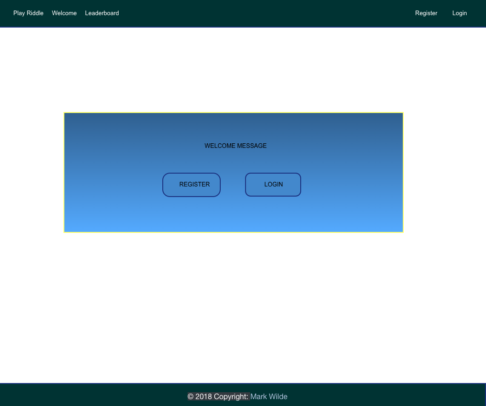
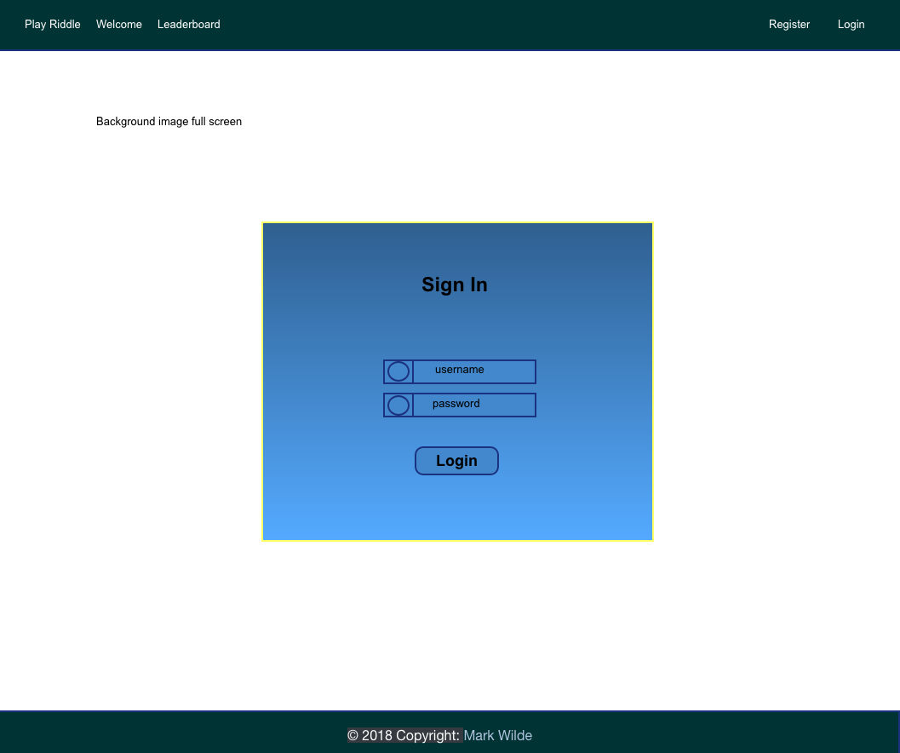
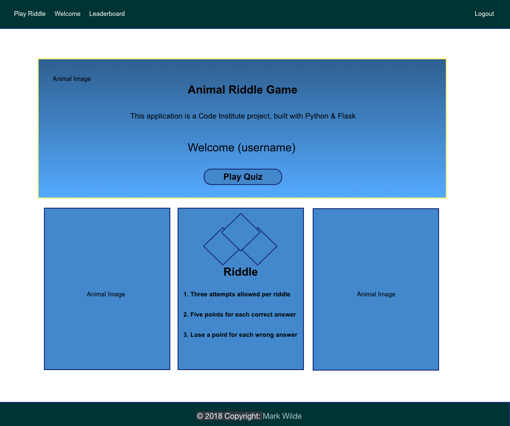
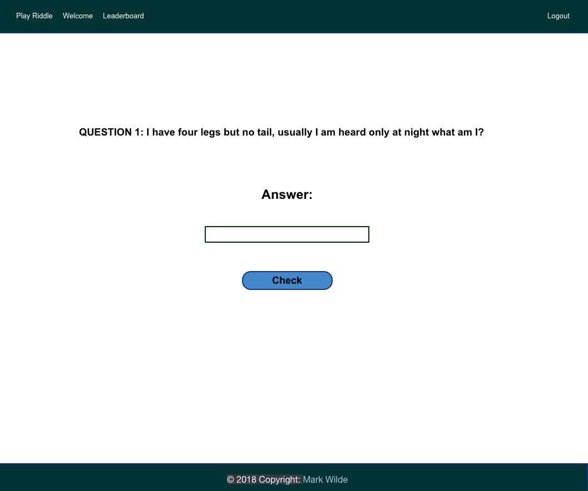
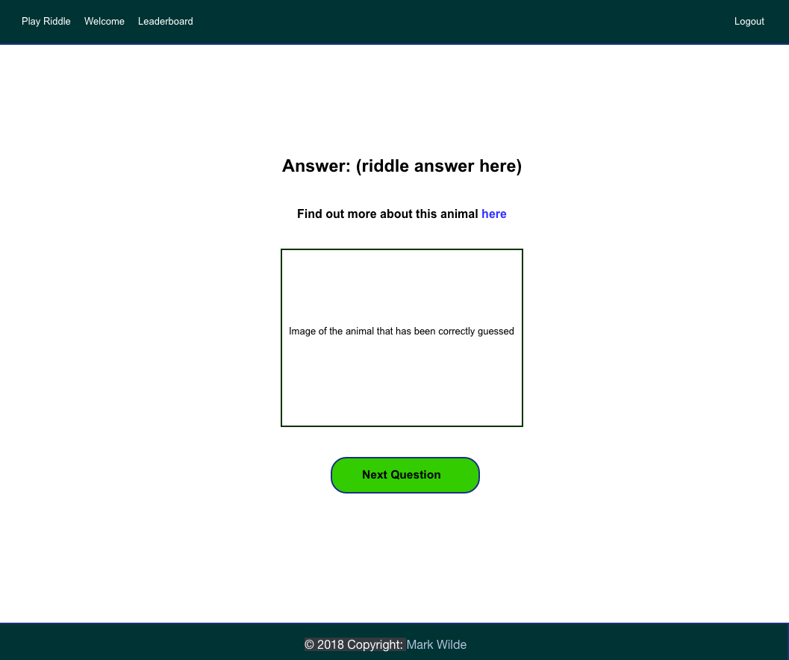
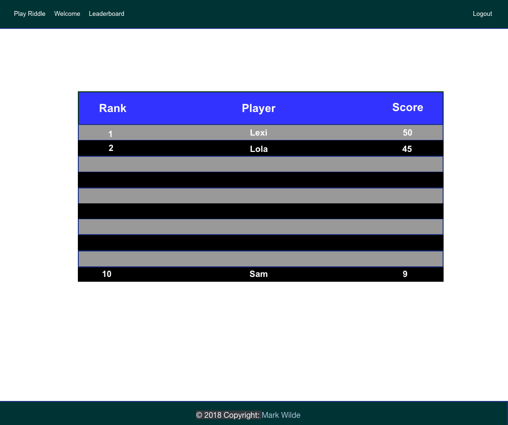

# Animal Riddle Game

### Code Institute: Practical Python Milestone Project

<a href="http://flask-riddle.herokuapp.com" target="_blank"> Click here to view website</a>

*Developer: Mark Wilde*

-------


## Index


1. [Project Instructions](#instructions-from-code-institute)
2. [Riddle Information](#riddle-information)
3. [UX](#ux)
    * [Wireframes](#wireframes)
    * [Design](#design)
    * [User Stories](#user-stories)
4. [Features](#features)
5. [Technologies](#technologies-used)
6. [Testing](#testing)
7. [Deployment](#deployment)
8. [Installation](#installation)
9. [Credits](#credits)


## Instructions From Code Institute


Guidelines for project development:


- The project's logic must be written in Python, HTML and CSS. Use flask, a micro-framework, to structure your project's back-end. 
- Build a web application game that asks players to guess the answer to a pictorial or text-based riddle.
- The player is presented with an image or text that contains the riddle. Players enter their answer into a textarea and submit their answer using a form.
- If a player guesses correctly, they are redirected to the next riddle.
- If a player guesses incorrectly, their incorrect guess is stored and printed below the riddle. The textarea is cleared so they can guess again.
- Multiple players can play an instance of the game at the same time, each in their own browser. Users are identified by a unique username, but note that no authentication features such as a password are required for this project.
- Create a leaderboard that ranks top scores for all (at least recent) users.
- You should conduct and document tests to ensure that all of your website’s functionality works well.
- Write a README.md file for your project.
- Use Git & GitHub for version control.
- Deploy the final version of your code to a hosting platform such as Heroku.


## Riddle Information


- Players are requested to register and login to play the game. They can then read the rules or began a game immediately.
- The game consists of 10 animal riddles.
- Players are allowed 3 guesses per riddle.
- Players receive 5 points for each correct answer.
- Players are deducted 1 point for each incorrect answer.
- Players are shown a question and can input their answer in the answer field. They click the check button to confirm their answer.
- When players give a correct answer they receive a success message and are shown an image of the animal. A link with further information regarding the animal is displayed above the image.
- Players continue with the riddle by clicking on the next question button which displays below the animal image when a correct answer is given.
- When players give an incorrect answer they receive a warning message which also displays how many attempts they have left.
- When a player gives 3 incorrect answers they receive a warning message and are taken to the next riddle.
- On completion of the riddle players receive a message with their final score. They are then directed to the leaderboard page which displays the top ten riddle scores.


## UX


### Wireframes

[Pencil](https://pencil.evolus.vn/) was used to create the wireframes.

<details>
      <summary><strong><em>Index page</em></strong></summary>

  
</details> 

<details>
   <summary><strong><em>Register page</em></strong></summary>
  
  
</details> 

<details>
   <summary><strong><em>Login page</em></strong></summary>
  
  
</details> 

<details>
   <summary><strong><em>Start quiz page</em></strong></summary>
  
  
</details> 

<details>
   <summary><strong><em>Play quiz page one</em></strong></summary>
  
  
</details> 

<details>
   <summary><strong><em>Play quiz page two</em></strong></summary>
  
  
</details> 


<details>
  <summary><strong><em>Leaderboard page</em></strong></summary>
  
  
</details> 


### Design


- Development of the website adhered to a mobile first approach. The site consists of six pages. It uses a simplistic design with minimal content so users can focus on the riddle game. 
  
- Some psychedelic animal images from the artist [Alex Grey](https://m.alexgrey.com/) were used to give the site some personality. Background images were used on some pages to add depth. An image on the start quiz page is hidden on smaller screens to improve the aesthetic.

- All pages share the same navbar and footer, though each page has a clear purpose and some unique functionality.
  
- The Bootstrap framework underpins the project and was implemented as per convention.

- The websites animal art was chosen as it is thought provoking and a little mysterious, this theme ties in well with the sites main purpose, it being an animal riddle quiz. 
 
- A picture of each animal displays on each correct answer, to keep users engaged.
  
- links to external sites with additional information were included, for those users who like to have easy access to further information.


### User Stories


Several user stories were considered before development began:


1. "As an animal lover I want to play a simple but engaging quiz game to test my knowledge."
 
2. "As an animal lover I want to see pictures of the animals used in the quiz and have an option to read more about each animal."

3. "I want to be able to register a username and sign in. I can then play multiple games and try to beat my previous scores."

4. "I want to be welcomed to the quiz by my unique username and have the rules presented to me before I play the game."

5. "On completion of the quiz I want to see my score and visit a leaderboard. Did I make the top ten? If so, were did I rank?"

6. "I want to play the quiz at the same time as my friends, each on our own browsers, and see who does the best."

7. "I want to be informed how of many guesses I have left when I get a question wrong."

8. "I want to be able to logout at any stage, even if I am in the middle of a game."


## Features


| Page        |                                                                                                                                                                                                                                                                           Description                                                                                                                                                                                                                                                                           |
| :---------- | :-------------------------------------------------------------------------------------------------------------------------------------------------------------------------------------------------------------------------------------------------------------------------------------------------------------------------------------------------------------------------------------------------------------------------------------------------------------------------------------------------------------------------------------------------------------: |
| Index       |                                                                                                                                                                                                                            This the the landing page. It is a basic page with a banner image, a register button and a login button.                                                                                                                                                                                                                             |
| Register    |                                                                                                                                                                                                                                        This page has a basic form for new users to register. It has a background image.                                                                                                                                                                                                                                         |
| Login       |                                                                                                                                                                                                                                            This page has a basic form for users to login. It has a background image.                                                                                                                                                                                                                                            |
| Start Quiz  |                                                                                                                                                 This page has a banner image with a welcome message. It has three image cards two of which contain animal art, the final card contains a riddle image and the riddle rules and is placed between the animal cards. These tree cards sit below the banner image.                                                                                                                                                 |
| Play Quiz   | This page contains the questions and answers for the quiz. Users input their answers in an answer box and click on the check button. When an answer is correct an image of the animal is displayed, a link for further information is provided; and users can click on the next question button to continue the quiz. When an answer is incorrect it is displayed in a warning message which also shows the number of remaining attempts available. When there are three incorrect attempts users receive a 'hard luck' message and the next question displays. |
| Leaderboard |                                                                                                                                                                                                                          This page provides a leaderboard table with the top ten user scores. It displays rank player name and score.                                                                                                                                                                                                                           |


## Existing/Future Technologies


- Another riddle which unlocks when users get a score of 40 points or more. This riddle would have a further 10 questions about animals and it's own leaderboard.
  
- A page hosting a photo collection and interesting information about each riddle animal.


## Technologies Used


### Virtual Environment


- [Pipenv](https://pipenv.readthedocs.io/en/latest/)
    - The project uses **Pipenv** to set a virtual environment.


### Front end


- [HTML](https://www.w3schools.com/html/default.asp)
    - The project uses **HTML** to create the pages.

- [CSS](https://www.w3schools.com/css/default.asp)
    - The project uses **CSS** to style the pages.

- [Bootstrap CSS Framework](https://getbootstrap.com/)
    - The project uses **Bootstrap** for styling and responsive design.

- [FontAwesome Icons](https://fontawesome.com/)
    - The project uses **FontAwesome** icons on the login form.

- [JQuery](https://jquery.com)
    - The project uses Bootstrap's **JQuery** for responsiveness.
  
- [JSON](https://www.json.org/)
    - The project uses **JSON** to organize data in files.
  

### Back end


- [Python](https://www.python.org/)
    - The project uses **Python** as per instructions.
  
- [Flask](http://flask.pocoo.org/)
    - The project uses the **Flask** micro web framework as per instructions.
  

###Version Control


- The project uses [Git](https://git-scm.com) as it's version control system.
  
- The project uses  a  [Github](https://github.com) repository.

   

## Testing


In this section, you need to convince the assessor that you have conducted enough testing to legitimately believe that the site works well. Essentially, in this part you will want to go over all of your user stories from the UX section and ensure that they all work as intended, with the project providing an easy and straightforward way for the users to achieve their goals.

Whenever it is feasible, prefer to automate your tests, and if you've done so, provide a brief explanation of your approach, link to the test file(s) and explain how to run them.

For any scenarios that have not been automated, test the user stories manually and provide as much detail as is relevant. A particularly useful form for describing your testing process is via scenarios, such as:

1. Contact form:
    1. Go to the "Contact Us" page
    2. Try to submit the empty form and verify that an error message about the required fields appears
    3. Try to submit the form with an invalid email address and verify that a relevant error message appears
    4. Try to submit the form with all inputs valid and verify that a success message appears.

In addition, you should mention in this section how your project looks and works on different browsers and screen sizes.

You should also mention in this section any interesting bugs or problems you discovered during your testing, even if you haven't addressed them yet.

If this section grows too long, you may want to split it off into a separate file and link to it from here.


## Deployment


The website has been deployed to [Heroku](https://www.heroku.com/) and can be accessed [here](https://flask-riddle.herokuapp.com/)


**Heroku Deployment**


1. Create an [Heroku](https://www.heroku.com/) account.

2. Create a new app 'flask-riddle' on heroku.com

3. Install [Heroku CLI](https://devcenter.heroku.com/articles/heroku-cli):
    ``` 
    $ brew install heroku/brew/heroku
    ``` 
4. Login to heroku:
    ``` 
    $ heroku login
    ``` 
5. Check app has been created by heroku:
    ``` 
    $ heroku apps
    ``` 
6. Add heroku remote:
    ``` 
    $ heroku git:remote -a flask-riddle
    ``` 
7. Add requirements.txt file (Allows heroku to access the projects build pack. This project uses a Pipenv virtual environment, a Pipfile.lock file is automatically generated which contains the build pack. However, this step has been included for reasons of best practice):
    ``` 
    $ sudo pip3 freeze --local > requirements.txt
    $ git add requirements.txt
    $ git commit -m " Added a requirements.txt"
    $ git push heroku master
    ``` 
      
8.  Add Procfile (Instructs heroku how start running the project):
    ``` 
    $ echo web: python app.py > Procfile
    $ git add Procfile
    $ git commit -m 'Added Procfile'
    $ git push heroku master
    ``` 
9.  Set up dynos:
    ``` 
    $ heroku ps:scale web=1
    ``` 
10. Setup config variables on heroku dashboard:
    - go to settings and click on reveal config vars
    -  Set IP to 0.0.0.0
    -  Set PORT to 5000

11. Restart dynos:
    - Navigate into the 'More' menu and select 'Restart all dynos' to update the apps settings.

12. Open app:
    -Click on the Open 'app' button to view your heroku deployed app in the browser.


## Installation


``` 
from the console type:

$ git clone https://github.com/markwilde33/CI-project-three
$ cd CI-project-three
$ pip3 install -r requirements.txt 
$ python3 app.py

```
App available at http://127.0.0.1:5000/


## Credits


[Code Institute](https://codeinstitute.net/)

The Html Fundamentals module, Css Fundamentals module, Python Fundamentals module,Practical Python module and the Data Centric Development module were used for guidance.


### Content


- [wikipedia](https://en.wikipedia.org/wiki/Animal) was used for animal information.
- [Youtube](https://www.youtube.com/watch?v=c0IRci0nz14) was used for animal riddles.


### Media


- [Google Images](https://www.google.com/search?q=google+images+alex+grey+animal+art&rlz=1C5CHFA_enIE780IE780&tbm=isch&tbo=u&source=univ&sa=X&ved=2ahUKEwjHo727o-PfAhXSC-wKHVndCBMQsAR6BAgGEAE&biw=1062&bih=978) was used for the animal art.


### Acknowledgements


- I received inspiration for this project from [Code Institute](https://codeinstitute.net/), [The Net Ninja](https://www.thenetninja.co.uk), [Brad Traversy](https://www.traversymedia.com/) and [Corey Schafer](https://www.youtube.com/user/schafer5/featured).

